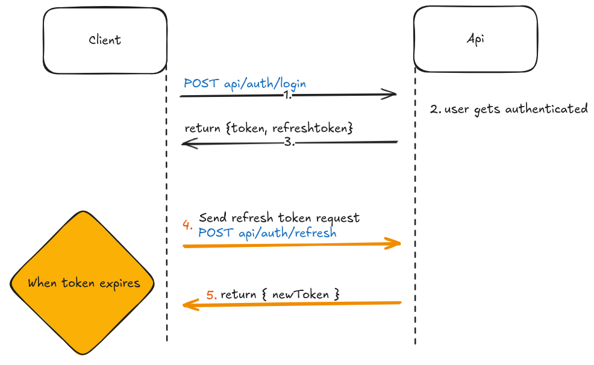

# React JWT Auth Example
This project serves an example to incorporate jwt token authentication in a React app. Also for integrating frontends to our backend(AllYourGoods API)



In the image above, you can see a simplified view of the authentication process.
The user registers and logs in to get a token. which can be saved in local storage. The token is then used to authenticate the user in the subsequent requests. The token is removed from the local storage when the user logs out.

# Considerations
## Token expiry not implemented
In the current state of the api you do not get an expiry time of the token immediately in the responsebody. But you can extract the expirytime by decrypting the token. You can use the following code to extract the expiry time:

```javascript
	import jwt from "jsonwebtoken";
	const token;
	const decoded = jwt.decode(token);
	console.log(decoded.exp);
```
## Saving the token in the local storage or in state
  Since there is no standard way to store tokens, you can choose to store the token in local storage or in state. Both have their own advantages and disadvantages:
  - Local storage is not secure
  - State is secure but it will be lost when the page is refreshed.

# Example with a react app
In this application we use Context to provide the token to childcomponents. The tokens are stored in local storage. The token is removed from the local storage when the user logs out.

## Overview of the components
- **AuthContext.tsx**: provides token to childcomponents.
	- Responsible for
    	- Signing in and out by storing or removing token from local storage
		- Providing the token to the components
- **UseRequiredAuth.tsx**: is used to protect the routes that require authentication. In this application, the pages are protected using this hook. **Pages** can be found in the pages folder
	- Responsible for
	 	- Redirecting the user to the login page if the user is not authenticated

## Where to find available endpoints and how to use them:
- visit https://ayga-api-test-1-app.azurewebsites.net/index.html

